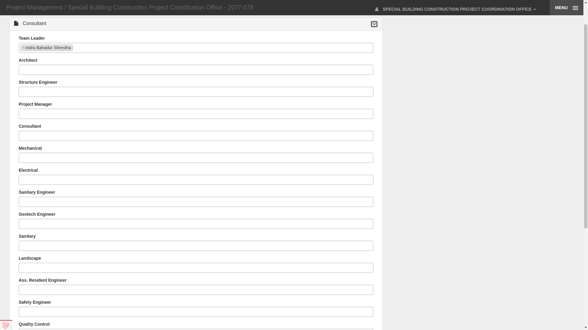
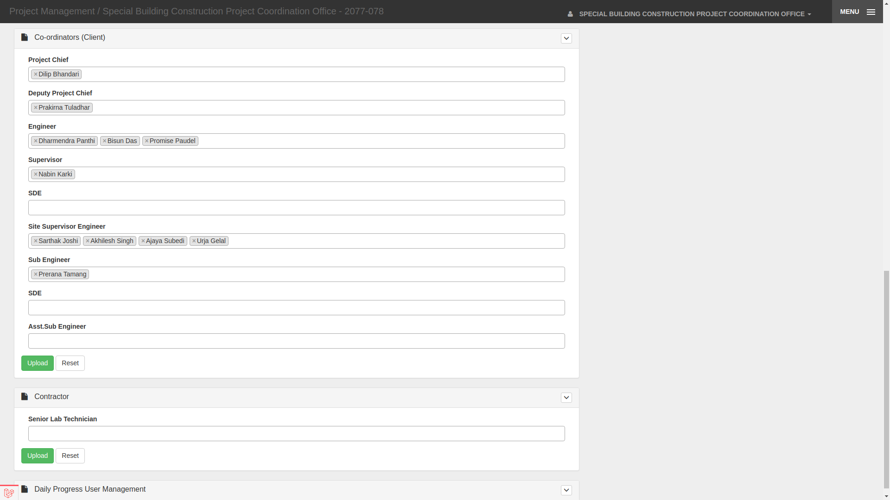
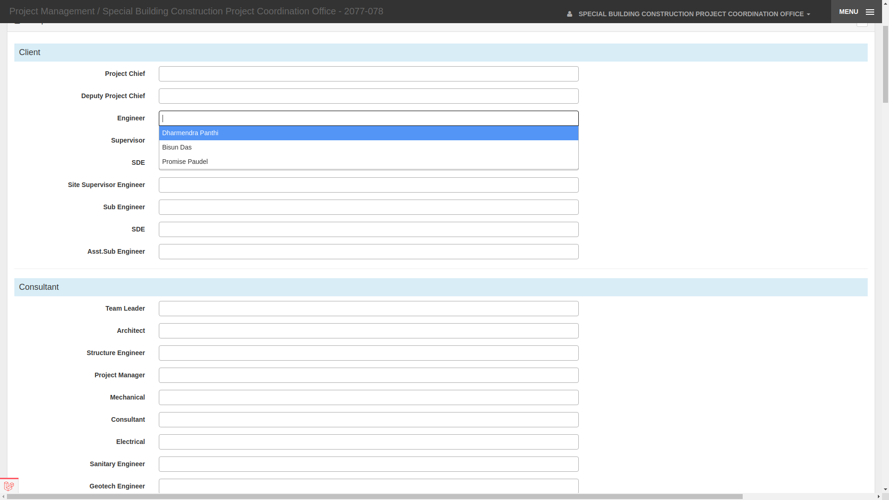
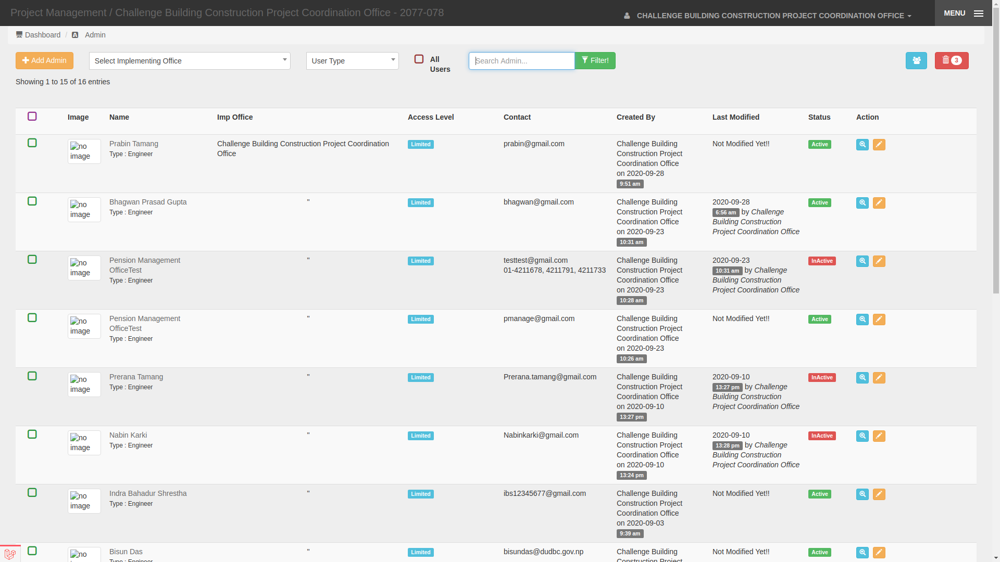

## PMIS-Challenge    
## Table of Contents

- [Getting Started](#getting-started)
	- [Prerequisites](#Prerequisites)
	- [Setup](#Setup)
- [Project Description](#project-description)
    - [Project Overview](#project-overview)
    - [Project Structure](#project-structure)
    - [Database and Models](#database-and-models)
- [Problems](#problems)
	- [Problem 1 - Manage Manpower and Human resources for Daily Progess](#problem-1--manage-manpowers-and-human-resources-for-project-and-dailyprogress)
	- [Problem 2 - Create Subdomain](#problem-2--all-operations-related-to-dailyprogress-should-be-under-sub-domain-daily-progressmain_url)
	- [Problem 3 - Create Api for materials and tools and equipment used](#problem-3--create-an-api-endpoint-to-calculate-the-total-quantity-of--materials-tools-and-equipment-used-per-week)
	- [Problem 4 - Display inactive human resources in root user page](#problem-4--display-list-of-humanresources-users-who-are-have-not-logged-into-system-for-at-least-2-days-the-list-should-only-be-visible-to-users-with-access-root-level)
	- [Problem 5 - Fix a bug in daily progress images](#problem-5--bug-fix)
	- [Problem 6 - ](#problem-6--rectify-data-at-db-level)
-[How To Submit](#how-to-submit)

# Getting Started
## Setup
### Prerequisites
* Laravel >5.8
* PHP >7
* MySQL Server.
* Any Preferred Workbench (Sequel Pro, MySQL Workbench) for SQL Databases.

### Local Development:
1. Fork the Repository: `https://github.com/dolpotech/pmis-challenge.git` and clone your forked Repo
2. Run `composer install` to Install Dependencies.
3. Copy contents of  `.env.example` file to a new file `.env`, If you're on Mac OSX or Linux just run: `cp .env.example .env`
4. Generate an app encryption key: `php artisan key:generate`.
5. create an empty database for the project and import docs/challenge_pmis.sql
6. In the `.env` file, add database information by filling the `DB_HOST`, `DB_PORT`, `DB_DATABASE`, `DB_USERNAME` and `DB_PASSWORD` options to match the credentials of the database you just created.
7. Migrate the database: `php artisan migrate`. **if required

# Project Description

### Project Overview
In PMIS-challenge, ImplementingOffices have many Projects each having its own DailyProgress records. 
In DailyProgress manpower and human-resources, tools and equipments, materials stock, quantities of work done, weather, images/
vidoes of progress are recorded.

We use `CHALLENGE BUILDING CONSTRUCTION PROJECT COORDINATION OFFICE` implementing_office for this challenge with associated root user having:
- `email`=challenge@gmail.com 
- `pass`=challenge@321

### Project Structure:
* Everything is quite similar to default laravel structure
* Except:
    Controllers are kept in `app\Http\Controllers\Admin` which extends `app\Http\Controllers\AdminBaseController`
   
* All routes in routes\web.php **including api routes**
        
        
        
### Database and Models:
 ER-Diagrams are in `docs/er_diagram/`

`ImplementingOffice` has many `Project`

`Project` has many `DailyProgress`

**DailyProgress:**

`DailyProgress` stores data in fields manpower, equipments, materials, activities, samples in associative-array form (like json)

`Manpower` & `Engineer`(Human Resource) Models are used to store data in `manpower` field of `DailyProgress`
Similarly, `Equipment` for `equipments`, `Material` for `materials` , `WorkActivity` for 'activities'

`created_by` and `updated_by` ForeignKey fields are taken from Authenticated User
Other fields are stored from input forms 


**User:**

`User` (table=pro_users)stores all users which has `access(varchar)` and `type_flag(int)` fields for
roles and permissions

`access` stores `Top Level` or `Limited` managed statically from select list in user creation form

`type_flag` is ForeignKey field uses `UserTypeFlag` model which stores 10 different types in table('pro_user_type')

**When human_resource is created , a user with `email = input_email  and password = mobile` is created automatically 
        
# Problems
### Problem 1 :: Manage Manpowers and Human Resources for project and dailyprogress
To register manpowers and human_resources(Model=Engineer) in dailyprogress we have to first assign them to its Project.
 
We have 3 types of manpower categories managed from helpers function `manpowerTypes()` which returns 
```
[
'1' => 'Client',
'2' => 'Consultant',
'3' => 'Contractor',
]
```
        
**We must divide manpowers and human resources under these categories dynamically** 

#### Manpower
`Manpower CRUD` is already given:
where different manpowers(positions) like  Project Chief,Deputy Project Chief, etc are registered under these categories
Datas are there too..
`Route::resource('manpower', 'Admin\ManpowerController');`

#### Human Resources
`Human Resources (model=Engineer) CRUD` is also given:
`Route::resource('engineers', 'Admin\EngineersController');`
Where people under positions are registered


### Expected Result :
In `Route::resource('project') -> Admin\ProjectController -> show() -> project/show.blade.php` 



```
Client
        -Manpower Title1 (eg:Project Chief)
            select list of manpower associated
            - HumanResource1 (ABC Adhikari)
            - HumanResource2 (XYZ Adhikari)
            - ....
        -Manpower Title2 (eg:Deputy Project Chief)     
            - ...
            - ...  
    
Consultant
        -Manpower Title1 (Project Chief)
            select list of manpower associated
            - HumanResource1 (ABC Adhikari)
            - HumanResource2 (XYZ Adhikari)
            - ....
        -Manpower Title2 (Deputy Project Chief)     
            - ...
            - ...  
Contractor
    .....
```
    
Human Resources added here should appear in select list in the same format in 
**Manpower At Site** of `Route::get('/project/{project}/daily-progress', ['as' => 'daily.progress', 'uses' => 'Admin\DailyProgressController@create']);`
        in `project/daily-progress.blade.php`        
### Expected Result :     
 
        
        
### Problem 2 :: all operations related to dailyprogress should be under SUB-DOMAIN daily-progress.main_url 
     
     if main_url is pmis-challenge.com | DP operations should be daily-progress.pmis-challenge.com/...

  
### Problem 3 :: create an API endpoint to calculate the total quantity of  materials, tools and equipment used per week
    
    this api neednot be under DP sub-domain 
    
    apptoken=5f24343e-0706-484e-acee-87a4c184ec39 for login api => /pro_admin/api/login
    
    data_structure = {
        'ImplementingOffice' : 'Name',
        'Project'            : 'Name',
        'DailyProgressWeek'  : {
                                'date_from': '',
                                'date_to': '',
                                },
        'MaterialsUsed'      : {
                                'material1' : {
                                                'quantity' : quantity used in that week',
                                                'unit' : 'Unit'
                                                }
                                'material2' : {
                                                'quantity' : quantity used in that week',
                                                'unit' : 'Unit'
                                                }
                                ........
                               },
                               
        'Tools&EquipmentsUsed' : {
                                    'Tool1' : 'quantity used in that week',
                                    'Tool2' : 'quantity..',
                                    ....
                                   },
    }
    
    Calculate MaterialsUsed from Materials Stock 
    
    
    
### Problem 4 :: Display List of HumanResources users who are have not logged into system for at least 2 days. The list should only be visible to users with access 'Root Level'
1. create a route which directs to a function in `UserController` which shows the users list who are have not logged into system for at least 2 days
2. add a button on users index_view to top right after search bar to view that page

3. also add it to side menu of partials/_admin_header.blade.php
    
### Problem 5 :: Bug Fix
    
    one particular image is showing in all DPs 
    
    Should identify the issue and fix it
    
    
### Problem 6 :: Rectify Data At DB-Level
    ..................


      

# How To Submit
send gmail to `info@mstech.com` with 
1. subject pmis-solution submit 
2. your solution-repo link